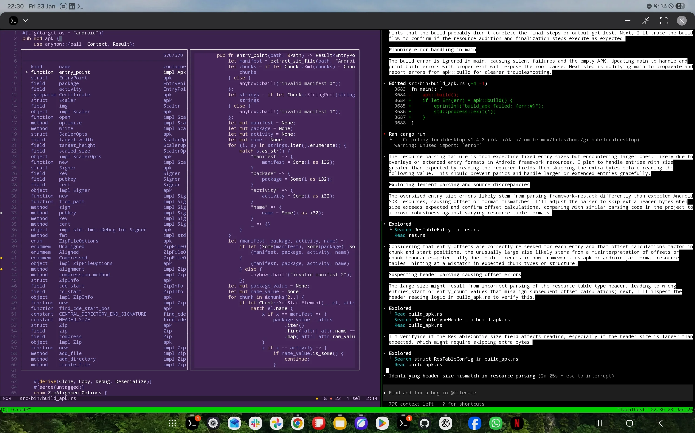
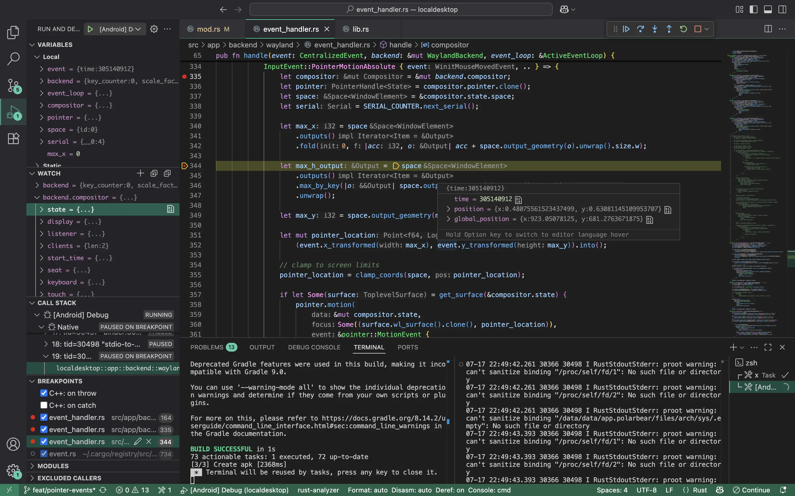

# Local Desktop

Local Desktop helps you run a desktop Linux environment on your Android device.

> Local Desktop is a Rust rewrite of the original [Polar Bear](https://github.com/localdesktop/polar-bear) project, which was written in Kotlin and C++. The aim of this rewrite is to make it more stable, portable, and able to do the development work on Android.

## How it works

1. An Arch Linux ARM64 filesystem is set up inside the app's internal storage.
2. Proot mounts the filesystem and provides a chroot-like environment.
3. A minimal built-in Wayland compositor runs in Android NDK.
4. Rootful Xwayland & a desktop environment launches inside the chroot and renders back to the Android native activity.


_Proof of Concept: A Pixel Tablet running the XFCE desktop environment inside a Proot-based ARM64 Linux. No configuration is required; just install and go._

## Getting Started

### How to build an APK

#### Termux

You can build the Local Desktop APK directly on your Android device. This is simple because no cross-compilation is needed. However, we only ship prebuilt libs for arm64, so this option only works on ARM64.
Make sure you have Rust installed in Termux:

```
pkg i rust
```

Then run `cargo run` in the project folder:

```bash
cargo run
```

After the build succeeds, you will find `localdesktop.apk` in the current folder. You can install it with `termux-open localdesktop.apk`, but in some cases you may need to `mv localdesktop.apk ~/storage/downloads` and install it from there. Make sure you have run `termux-setup-storage` before moving it outside Termux.

#### Linux/Mac/Windows

The above option is suitable for quick development on Android. However, if you need to build an AAB (for distribution to Google Play), debug with Visual Studio Code, or compile for unsupported targets (like x64 Android), then you need to cross-build it from your PC.
Along with Rust, please make sure you have these components installed:

```
brew install llvm lld gradle@8
```

Then install our local version of xbuild:

```bash
cargo install --path patches/xbuild/xbuild
x build --release --platform android --arch arm64 --format apk
```

Alternatively, trigger the default build task by pressing `Ctrl+Shift+B`.

You can find the output APK in:

```bash
open target/x/release/android/gradle/app/build/outputs/apk/debug/
```

### How to develop

#### Termux

We recommend the following setup, but feel free to use your own favorite tools for development:

```
pkg install helix helix-grammars rust-analyzer
```

A wonderful thing about developing directly on Android is that an agent like [Codex on Termux](https://github.com/DioNanos/codex-termux) can **test the code for you** by running unit tests, reading the output, understanding what went wrong, and trying again. In my experience, this is not possible when cross-developing on other operating systems, so you have to run the tests yourself.




#### Linux/Mac/Windows

Recommended setup:

- **IDE**: Visual Studio Code

- **Extensions**:

  - [Rust Analyzer](https://marketplace.visualstudio.com/items?itemName=rust-lang.rust-analyzer)
  - [Android Debug](https://marketplace.visualstudio.com/items?itemName=nisargjhaveri.android-debug)
  - [CodeLLDB](https://marketplace.visualstudio.com/items?itemName=vadimcn.vscode-lldb)

- **Instructions**:

  1. Open Visual Studio Code.
  2. Launch the `[Android] Debug` configuration from the debug panel. This will:
     - Build the Rust code into an APK.
     - Install the APK on a selectable device, and launch the app in debug mode.
     - Redirect stdout/stderr output to the terminal.



> **Tip**: You can debug the app on either a physical device or a virtual device.

For more instructions on how to work on this project, please visit the [Developer Manual](https://localdesktop.github.io/docs/developer/how-it-works).
